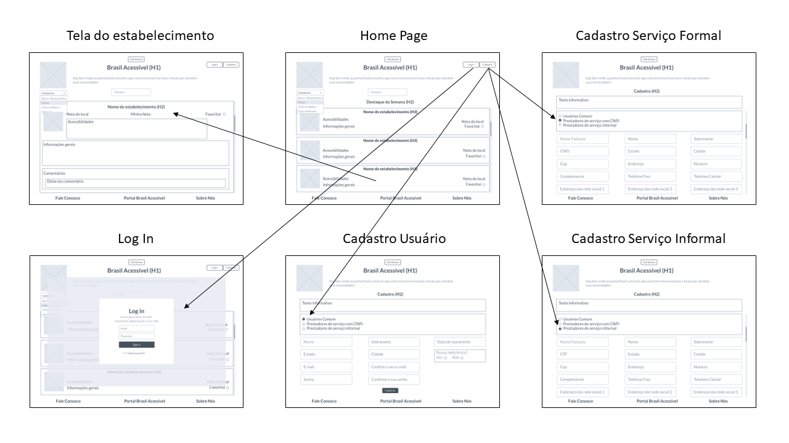
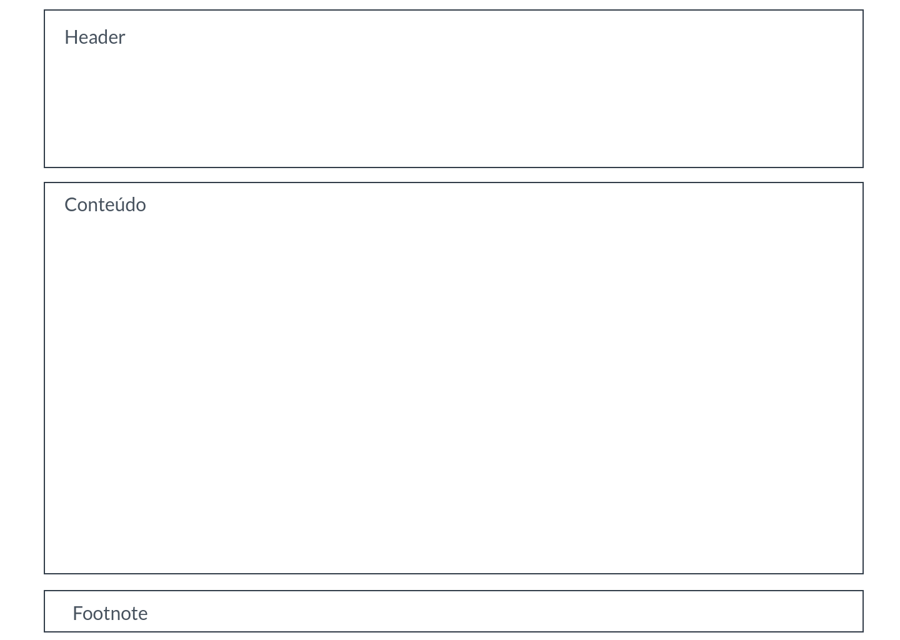
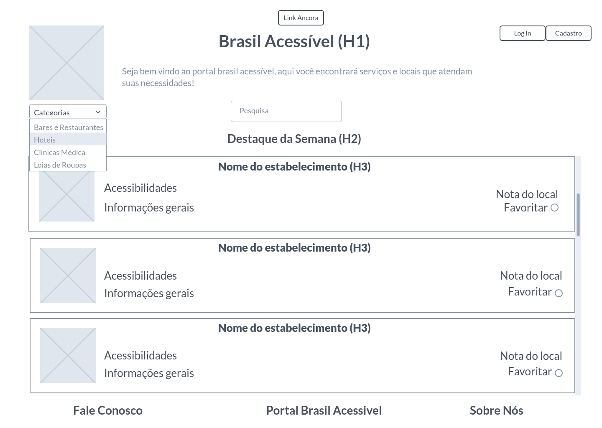
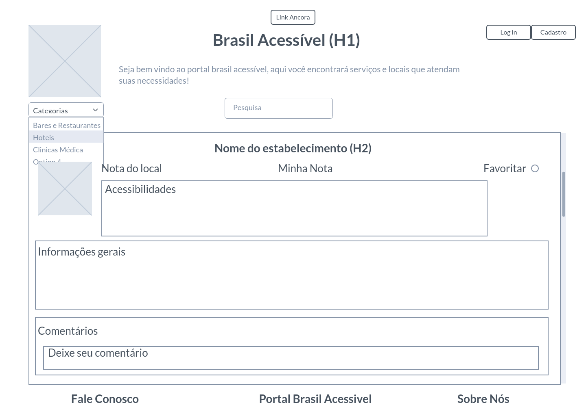
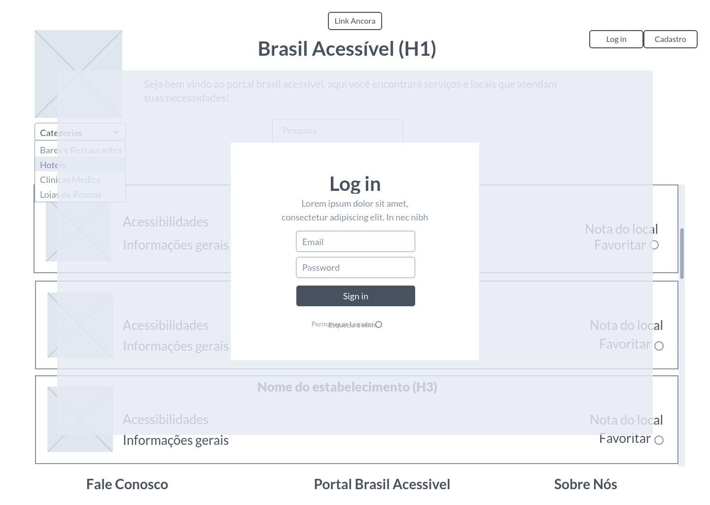
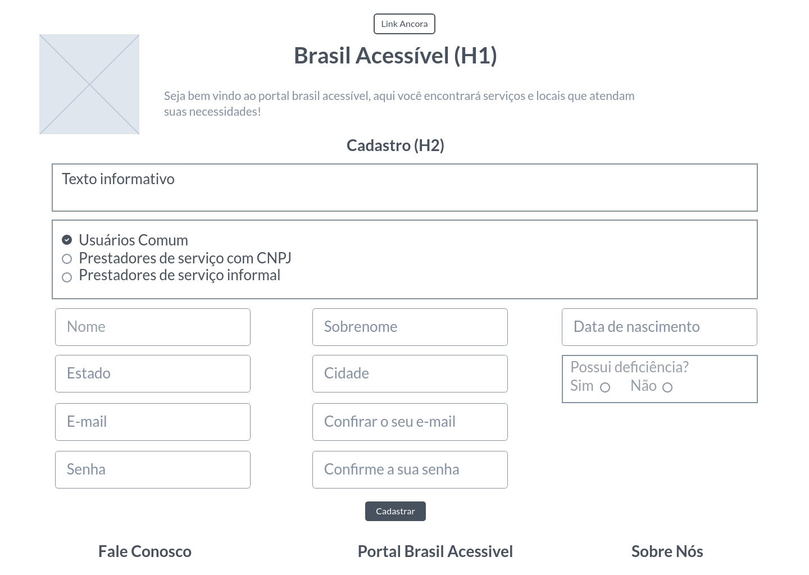
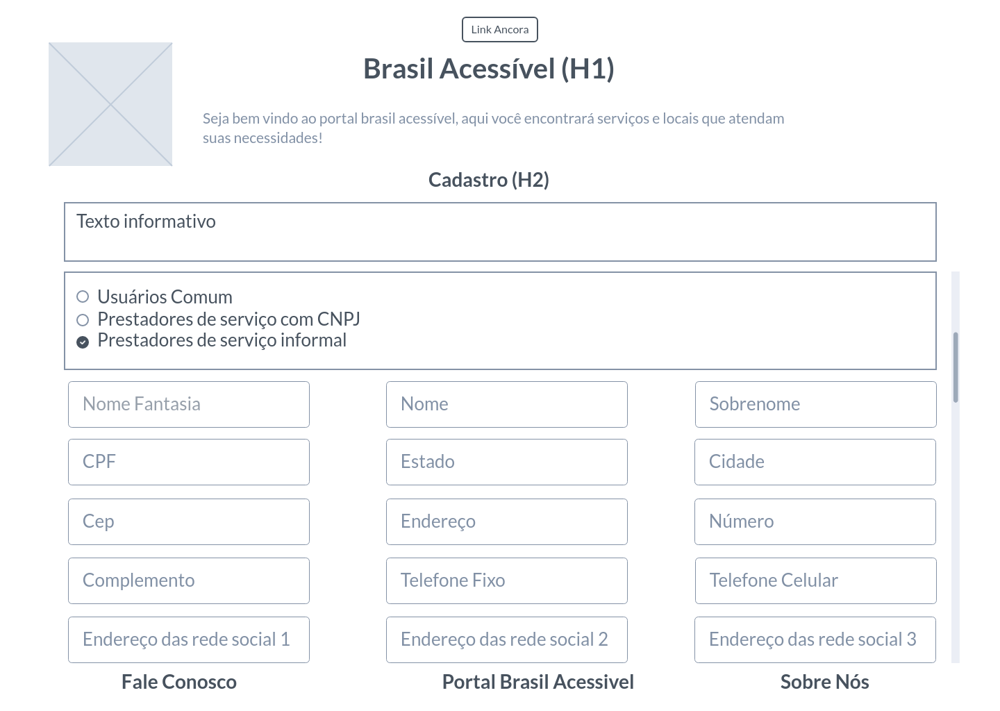
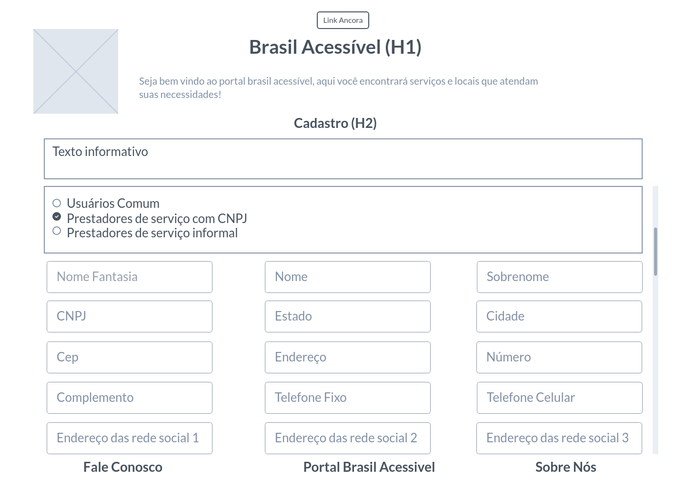

HTM
# Projeto de Interface

Dentre as preocupações para a montagem da interface do sistema, estamos estabelecendo foco em questões como agilidade, acessibilidade e usabilidade. Desta forma, o projeto tem uma identidade visual padronizada em todas as telas que são projetadas para funcionamento em desktops e dispositivos móveis.

## User Flow

O diagrama apresentado na Figura X mostra o fluxo de interação do usuário pelas telas do sistema. Cada uma das telas deste fluxo é detalhada na seção de Wireframes que se segue. Para visualizar o wireframe interativo, acesse o ambiente MarvelApp do projeto.

## Wireframes

Conforme fluxo de telas do projeto, apresentado no item anterior, as telas do sistema são apresentadas em detalhes nos itens que se seguem. As telas do sistema apresentam uma estrutura comum que é apresentada na Figura 4. Nesta estrutura, existem 3 grandes blocos, descritos a seguir. São eles:
- Header - local onde são dispostos elementos fixos de identidade (logo e nome do site), navegação principal do site (menu da aplicação) e Link Ancora (melhor acessibilidade para o site)
-	Conteúdo - apresenta o conteúdo da tela em questão;
-	Footnote - apresenta os elementos informativos sobre o site e acessibilidade e comunicativos com os operadores do site.

## Tela - Home-Page

A tela de home-page mostra os estabelecimentos em destaque da semana a partir da API utilizada pelo sistema. 
Com base na estrutura padrão, o Bloco Header traz a logo e o nome do site, slogan, os botões links âncora, log in, cadastrar e a barra de pesquisa, além da barra de categorias. O Bloco Conteúdo traz os estabelecimentos em destaque da semana (imagem, nome do estabelecimento, acessibilidades, nota do local, informações gerais e opção de favoritar). O Bloco Footnote traz os links para contado com os organizadores do site (Fale Conosco), mais informações sobre acessibilidade (Portal Brasil Acessível) e mais informações sobre o site (Sobre Nós).

 

## Tela – Estabelecimento

A tela de estabelecimento apresenta, no Bloco Conteúdo, as informações de acessibilidade desse estabelecimento, além de fotos, informações, comentários e a nota do local. O Bloco Header e Footnote apresenta os mesmos elementos da Home-Page. 

 

## Tela – Log In

A tela de log in é uma janela modal (surge sobre outras janelas) quando o usuário pressiona o botão log in do header. Nela o usuário vai colocar seu e-mail e senha para logar e escolher se quer permanecer logado. 

## Tela – Cadastro de Usuário Comum

A tela de cadastro de usuário comum apresenta, no Bloco Conteúdo, os input fields que o usuário precisa preencher para que o mesmo se cadastre no site, como o nome, e-mail, cidade, se possui alguma deficiência entre outras informações para que o usuário consiga cadastrar no site e ter informações mais precisas sobre a sua preferência. O Bloco Header apresenta o logo e o nome do site, o slogan e o botão de link ancora e o Bloco Footnote apresenta os mesmos elementos da Home-Page.

## Tela – Cadastro de Prestador de Serviço Informal

A tela de cadastro de prestador de serviço informal apresenta, no Bloco Conteúdo, os input field que o prestador de serviço precisa preencher para que o seu serviço seja mostrado no site, como o nome fantasia, nome da pessoa, CPF, e-mail, cidade, telefone entre outras informações. O Bloco Header apresenta o logo e o nome do site, o slogan e o botão de link ancora e o Bloco Footnote apresenta os mesmos elementos da Home-Page.

## Tela – Cadastro de Prestador de Serviço com CNPJ

A tela de cadastro de prestador de serviço com CNPJ apresenta, no Bloco Conteúdo, os input field que o prestador de serviço precisa preencher para que o seu serviço seja mostrado no site, como o nome fantasia, nome da pessoa, CNPJ, e-mail, cidade, telefone entre outras informações. O Bloco Header apresenta o logo e o nome do site, o slogan e o botão de link ancora e o Bloco Footnote apresenta os mesmos elementos da Home-Page.

