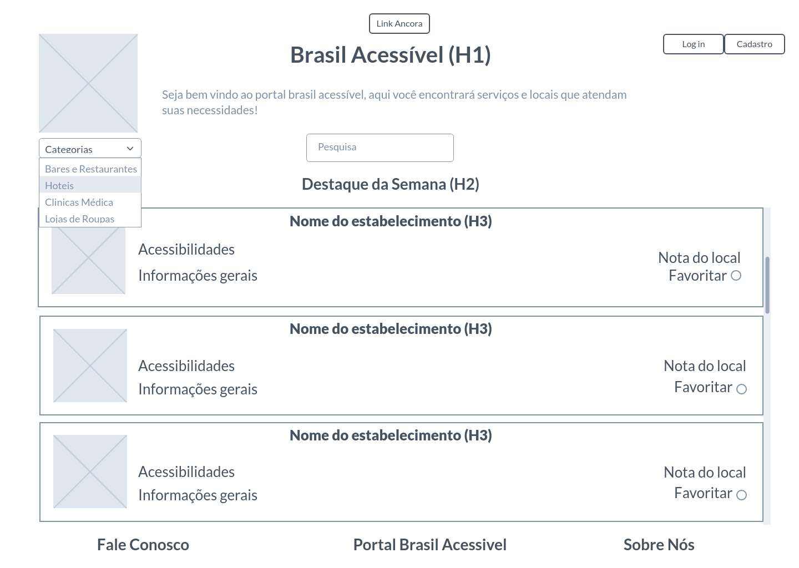

# Programação de Funcionalidades

Pré-requisitos: <a href="2-Especificação do Projeto.md"> Especificação do Projeto</a>, <a href="3-Projeto de Interface.md"> Projeto de Interface</a>, <a href="4-Metodologia.md"> Metodologia</a>, <a href="3-Projeto de Interface.md"> Projeto de Interface</a>, <a href="5-Arquitetura da Solução.md"> Arquitetura da Solução</a>

Implementação do sistema descritas por meio dos requisitos funcionais e/ou não funcionais. Deve relacionar os requisitos atendidos os artefatos criados (código fonte) além das estruturas de dados utilizadas e as instruções para acesso e verificação da implementação que deve estar funcional no ambiente de hospedagem.

Para cada requisito funcional, pode ser entregue um artefato desse tipo

> **Links Úteis**:
>
> - [Trabalhando com HTML5 Local Storage e JSON](https://www.devmedia.com.br/trabalhando-com-html5-local-storage-e-json/29045)
> - [JSON Tutorial](https://www.w3resource.com/JSON)
> - [JSON Data Set Sample](https://opensource.adobe.com/Spry/samples/data_region/JSONDataSetSample.html)
> - [JSON - Introduction (W3Schools)](https://www.w3schools.com/js/js_json_intro.asp)
> - [JSON Tutorial (TutorialsPoint)](https://www.tutorialspoint.com/json/index.htm)

Nesta seção são apresentadas as telas desenvolvidas para cada uma das funcionalidades do sistema. O respectivo endereço (URL) e outras orientações de acesso são são apresentadas na sequência.

## Seleção de Categorias (RF-003 e RF-006)

A tela principal do sistema possui um menu de categoria para selecionar um tipo de estabelecimento desejado. Ao selecionar uma categoria, os estabelecimentos que fazem parte dela irá ser apresentado na tela, com suas respectivas informações. As informações sobre os estabelecimentos são armazenada no LocalStorage com estruturas baseada em JSON.

### Requisitos atendidos
* RF-003
* RF-006

### Artefatos da funcionalidade
* index.html
* style.css
* bd.js

### Estrutura de Dados

### Instruções de Acesso
1. Faça o download do arquivo do projeto (ZIP) ou clone do projeto no GitHub;
2. Descompacte o arquivo em uma pasta específica;
3. Abra o Visual Studio Code e execute o Live Server;
4. Abra um navegador de Internet e informe a seguinte URL: http://localhost:5500/index.html

