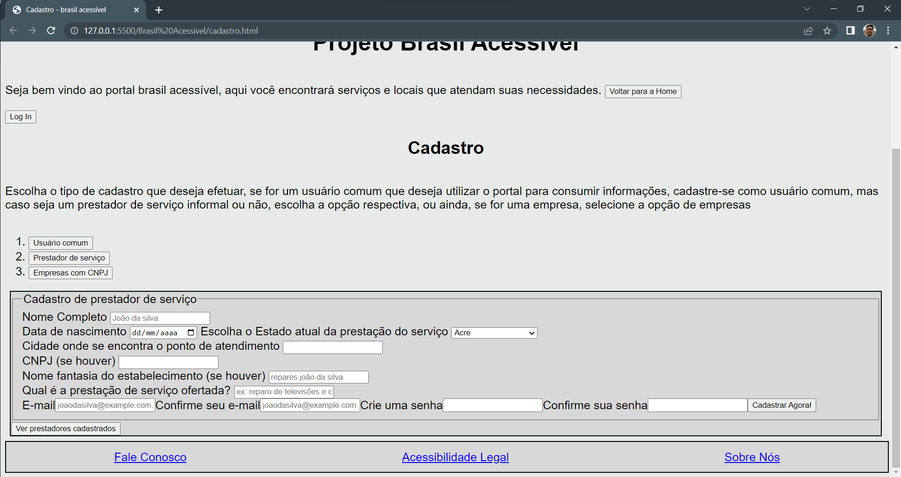

# Programação de Funcionalidades

Nesta seção são apresentadas as telas desenvolvidas para cada uma das funcionalidades do sistema. O respectivo endereço (URL) e outras orientações de acesso são são apresentadas na sequência.

## Seleção de Categorias (RF-003 e RF-006)

A tela principal do sistema possui um menu de categoria para selecionar um tipo de estabelecimento desejado. Ao selecionar uma categoria, os estabelecimentos que fazem parte dela irá ser apresentado na tela, com suas respectivas informações. As informações sobre os estabelecimentos são armazenada no arquivo JS com estrutura baseada em JSON.

### Requisitos atendidos
* RF-003
* RF-006

### Artefatos da funcionalidade
* index.html
* style.css
* bd.js

### Estrutura de Dados

### Instruções de Acesso
1. Faça o download do arquivo do projeto (ZIP) ou clone do projeto no GitHub;
2. Descompacte o arquivo em uma pasta específica;
3. Abra o Visual Studio Code e execute o Live Server;
4. Abra um navegador de Internet e informe a seguinte URL: http://localhost:5500/Brasil%20Acessivel/login.html
5. Clique no botão Menu Categorias

## Log In (RF-008 e RF-013)

A tela de Login serve para altenticar os usuários, e logo após exibe informações sobre o usuário altenticado. As informações do Login são armazenadas em um arquivo JS com estrutura JSON.

### Requisitos atendidos
* RF-008
* RF-013

### Artefatos da funcionalidade
* login.html
* style.css
* bd.js

### Estrutura de Dados

### Instruções de Acesso
1. Faça o download do arquivo do projeto (ZIP) ou clone do projeto no GitHub;
2. Descompacte o arquivo em uma pasta específica;
3. Abra o Visual Studio Code e execute o Live Server;
4. Abra um navegador de Internet e informe a seguinte URL: http://localhost:5500/Brasil%20Acessivel/login.html
5. Informe um e-mail e senha já cadastrado e precione o botão "fazer login".

## Cadastro (RF-010)

A tela de cadastro serve para cadastrar os usuários e empresas que quiserem fazer parte do website. Há um botão que mostra todos os usuários e prestadores de serviços cadastrados no sistema. As informações do cadastro são armazenadas em um arquivo JS com estrutura JSON.

### Requisitos atendidos
* RF-010

### Artefatos da funcionalidade
* cadastro.html
* style.css
* bd.js

### Estrutura de Dados

### Instruções de Acesso
1. Faça o download do arquivo do projeto (ZIP) ou clone do projeto no GitHub;
2. Descompacte o arquivo em uma pasta específica;
3. Abra o Visual Studio Code e execute o Live Server;
4. Abra um navegador de Internet e informe a seguinte URL: http://localhost:5500/Brasil%20Acessivel/cadastro.html
5. Clique em uma opção de cadastro;
6. Clique no botão Ver Usuários Cadastrado ou Ver Prestador Cadastrado.
